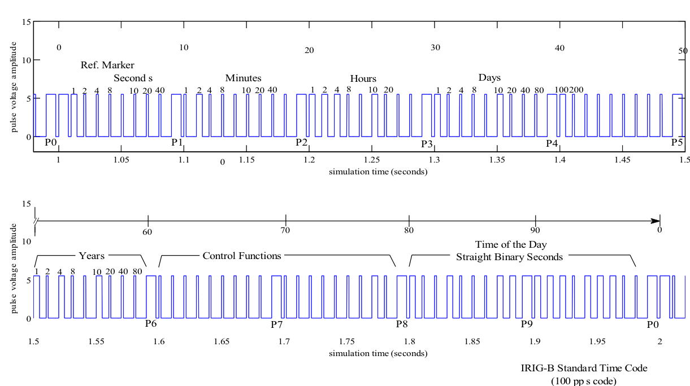

# IRIG-B Signal Generator for Real-Time Hardware-in-the-Loop Simulation
IRIG-B Signal Generator Code in Matlab/Simulink for use with Real-Time Simulators.

## Aim
With the aim of assessing the impact of time-synchronization signals on synchrophasor applications, it is necessary to control a PMU's timing signal.
This can be achieved by generating both three-phase and timing signals in real-time and then feed it to the PMU.

The IRIG-B code generator in this repository serves this aim. Basic control blocks from SIMULINK’s library can be used to vary the accuracy of the time signal supplied. An Inter-Range Instrumentation Group Code B (IRIG-B) time signal is used here as a high accuracy PMU timing source. It distributes time to PMUs with an accuracy of ±500ns and can be simulated and controlled using SIMULINK. The PMU under test also requires balanced three-phase voltage and current signals as inputs. Both signals required, i.e. IRIG- B timing signal and the three-phase voltage and current (V and I) signals, can be simulated in SIMULINK. These signals can be sent in real-time as inputs to the PMU. The structure of IRIG-B time code which was simulated in real-time for PMU time synchronization is provided in the following source code.

# Source Code
* irig_only.mdl

This is a Simulink model with the IRIG-B generator code embedded.
Double click the transmitter1 block to set the starting time (initial time).
To be able to record the data in a PDC while supplying a simulated IRIG-B time to external equipment (i.e. PMUs), the actual time, day and year should be specified.

--------------------------------------------------------------------------------

* irig_pulse_generator.m

This Matlab script contains the code to simulate the IRIG-B Pulse.
The IRIG-B pulse amplitude is set to be 5.5V

--------------------------------------------------------------------------------

* irig_final.mdl

Use this model to simulate time, current and voltage signals to serve as inputs to the PMUs.
Voltage and Current signals might need to be amplified according to the input requirements
of the PMUs or should be connected to the low voltage interface of the equipment while respecting their operation limits.
The IRIG-B pulse of 5.5V amplitude can be fed directly to the PMUs using a BNC cable.
The transmission delays are used to apply an error in the time signal with a 10us step.
The voltage and current signals can also be delayed by using the transmission delay blocks.

--------------------------------------------------------------------------------

# Cite our work!
Please cite any of the following three papers depending on the use of our code.
Pre-prints of the papers listed below are available in the ``./01_docs`` sub-folder.

> M. S. Almas; L. Vanfretti; R. S. Singh; G. M. Jonsdottir, "Vulnerability of Synchrophasor-based WAMPAC Applications’ to Time Synchronization Spoofing," in IEEE Transactions on Smart Grid. doi: 10.1109/TSG.2017.2665461

> R. S. Singh, H. Hooshyar and L. Vanfretti, "Laboratory test set-up for the assessment of PMU time synchronization requirements," 2015 IEEE Eindhoven PowerTech, Eindhoven, 2015, pp. 1-5. doi: 10.1109/PTC.2015.7232731

> R. S. Singh, H. Hooshyar and L. Vanfretti, "Assessment of time synchronization requirements for Phasor Measurement Units," 2015 IEEE Eindhoven PowerTech, Eindhoven, 2015, pp. 1-6. doi: 10.1109/PTC.2015.7232728

# Contributors
- Ravi Singh ([ravi2024](https://github.com/ravi2024))
- Maxime Baudette ([MaximeBaudette](https://github.com/MaximeBaudette))
- Luigi Vanfretti ([lvanfretti](https://github.com/lvanfretti))
- Hossein Hooshyar (h.hoosh@gmail.com)

# License
Thi is free/libre software and the use is completely at your own risk; it can be redistributed and/or modified under the terms of the GNU Public License version 3.

Copyright (C) 2017,  Ravi Singh, Luigi Vanfretti.
